# Leech Ganglion Calcium Imaging — Analysis Report

**Recording:** `helobdella_LeechNo2_elavgcamp6m-17.tif` — pan-neuronal `elav`-GCaMP6m, *Helobdella* ventral nerve cord.
**Acquisition:** 692 frames (~240 s) · 700×700 px · 1.3 µm/px · single plane/channel · frame interval 0.347 s → **fs ≈ 2.88 Hz** (Nyquist 1.44 Hz).
**Tools:** suite2p 1.1.0 (registration) + custom `analysis/calcium/` module (everything else). Math is unit-tested (`tests/test_calcium_analysis.py`, 10 passing).

> *A longer version with every caveat spelled out is in `REPORT.full.md`.*

---

## Pipeline (what I did)

1. **Installed suite2p 1.1.0** into the project `uv` venv.
2. **Registered** the movie (motion correction). Drift was ~0 px rigid / <0.5 px non-rigid — the prep is essentially motionless. All traces come from the registered binary (`data.bin`). *(Caveat: residual sub-pixel motion could still mimic a whole-field brightness signal — see Caveats.)*
3. **Annotated 11 ganglia** by hand in a napari tool I built, on the local-correlation background. Saved two ROI **sets**: `full` (100%) and `small` (each polygon shrunk to 65% about its centroid, off the bright edges). Both renumbered **G1…G11 left→right** (G1 anterior, G11 posterior).
4. **Per-ganglion ΔF/F** + correlation / raster / lag / events / pixel maps.
5. **Removed the shared global signal** and re-ran (`--remove-global`).
6. **Characterised the rhythm**: power spectrum + per-pixel phase map.
7. **Batched** suite2p + phase analysis over **15 recordings** to test replication.

Each plot below: **What it is → How to read it → Interpretation.**

---

## 1. Finding the ganglia

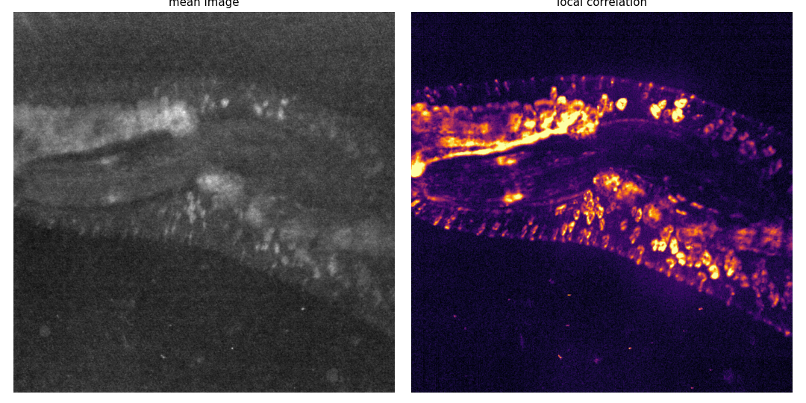

- **What.** *Left:* time-averaged image (anatomy). *Right:* local-correlation image — each pixel's mean temporal correlation with its 4 neighbours.
- **Read.** Bright = a pixel fluctuates in sync with its neighbours (coherent signal); shot noise stays dark. Coherence can be neural *or* whole-field modulation.
- **Interpret.** The correlation image cleanly reveals the diagonal **chain of segmental ganglia**. Used only to localize the cord for annotation — not to prove the signal is neural.

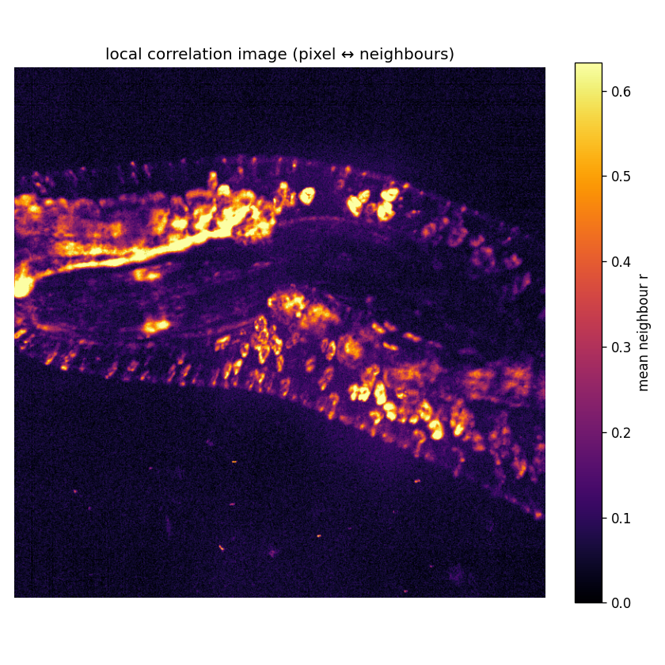

---

## 2. The annotated ganglia

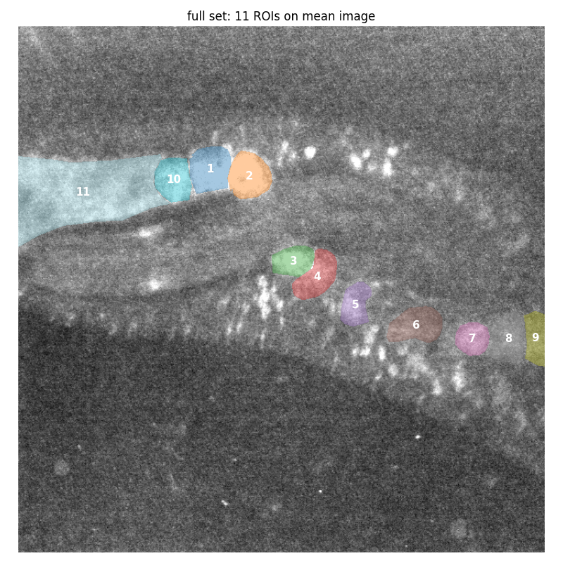

11 hand-drawn ganglion ROIs (the `full` set) over the mean image; each coloured patch is one ganglion, numbered along the cord.

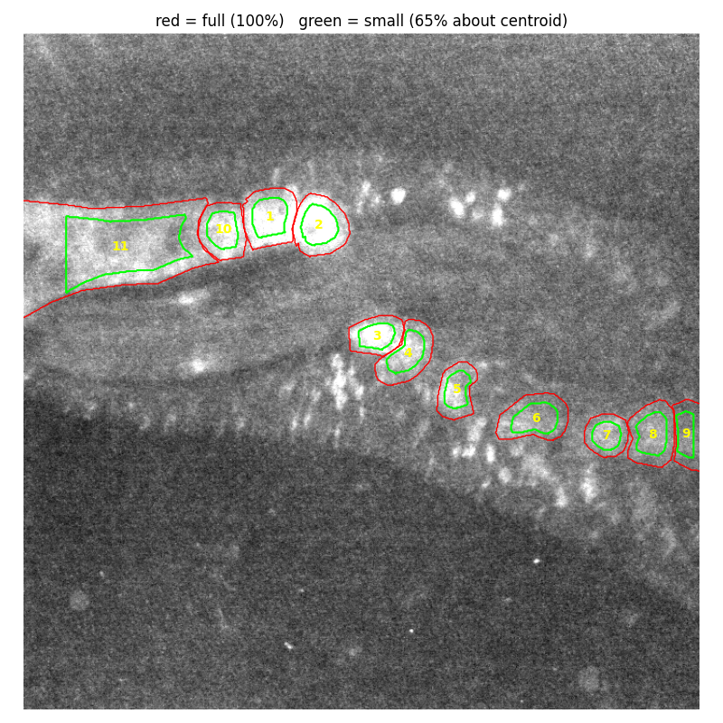

**Red = full** (100%), **green = small** (65%, shrunk toward centre). The green nests inside the red, off the bright borders — shrinking tests whether results depend on edge/background contamination.

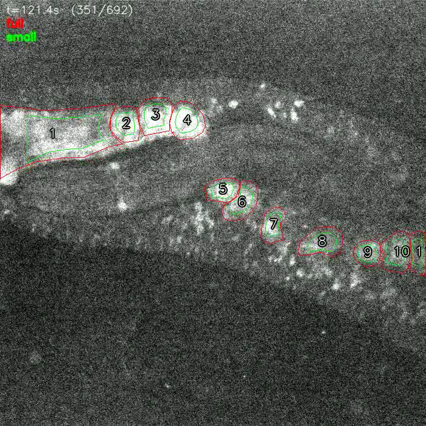

A frame from the overlay video (`…/runs/…-17/overlay.mp4`) with both ROI sets + left-to-right numbers burned in; play it to watch activity under each ganglion over time.

---

## 3. Per-ganglion activity (raw ΔF/F)

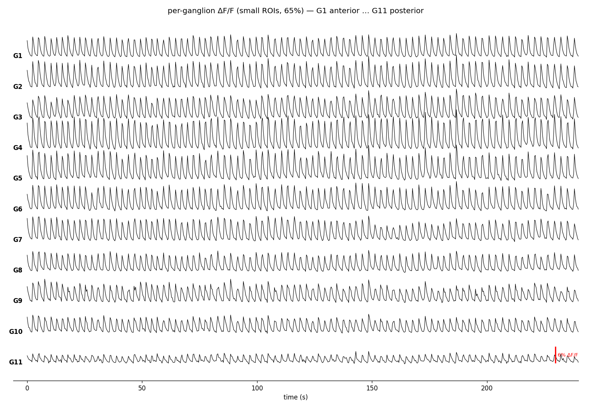

- **What.** One row per ganglion (G1→G11). ΔF/F = (F−F₀)/F₀, F₀ = rolling 8th-percentile baseline. Red bar = scale.
- **Read.** Row position is just an offset; look at the wiggles (up = brighter).
- **Interpret.** Every ganglion carries the **same regular, near-synchronous fluctuation**. Its ~0.36 Hz frequency is pinned down by the spectrum (§8); synchrony is quantified in §10.

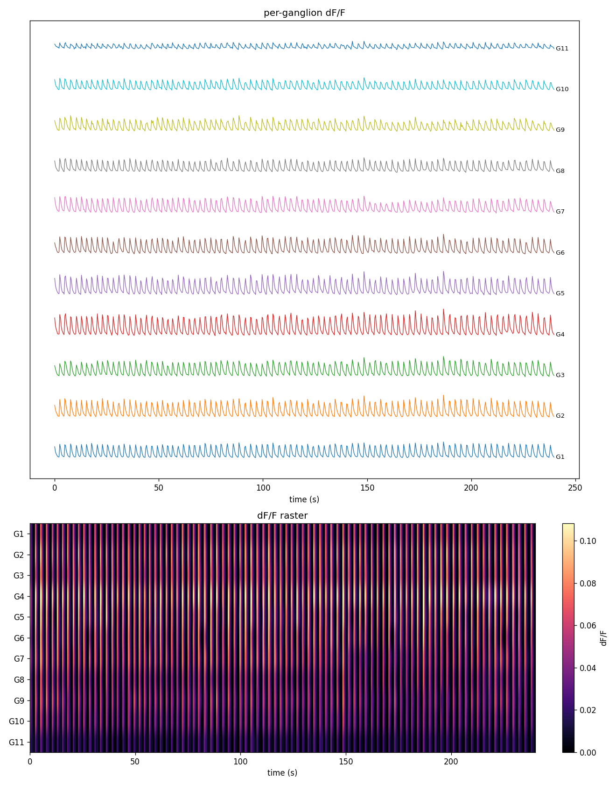

Same traces (top) + raster heatmap (bottom; colour = ΔF/F). **Vertical stripes spanning all rows = all ganglia bright at the same instants = synchrony**, which is what appears.

---

## 4. Pixel-level correlation (seed maps)

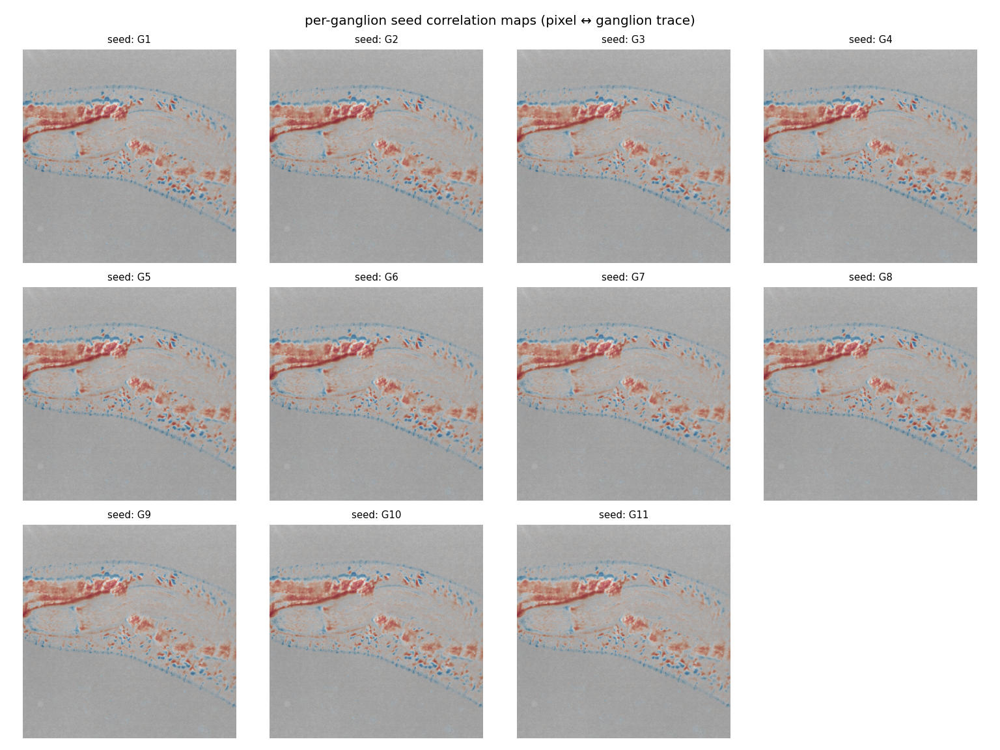

For each ganglion ("seed"), every pixel is coloured by how strongly it correlates with that ganglion's mean trace (red = positive). Because of the global rhythm, each seed lights up much of the whole cord — another view of the pervasive synchrony.

---

## 5. Ganglion × ganglion correlation — RAW

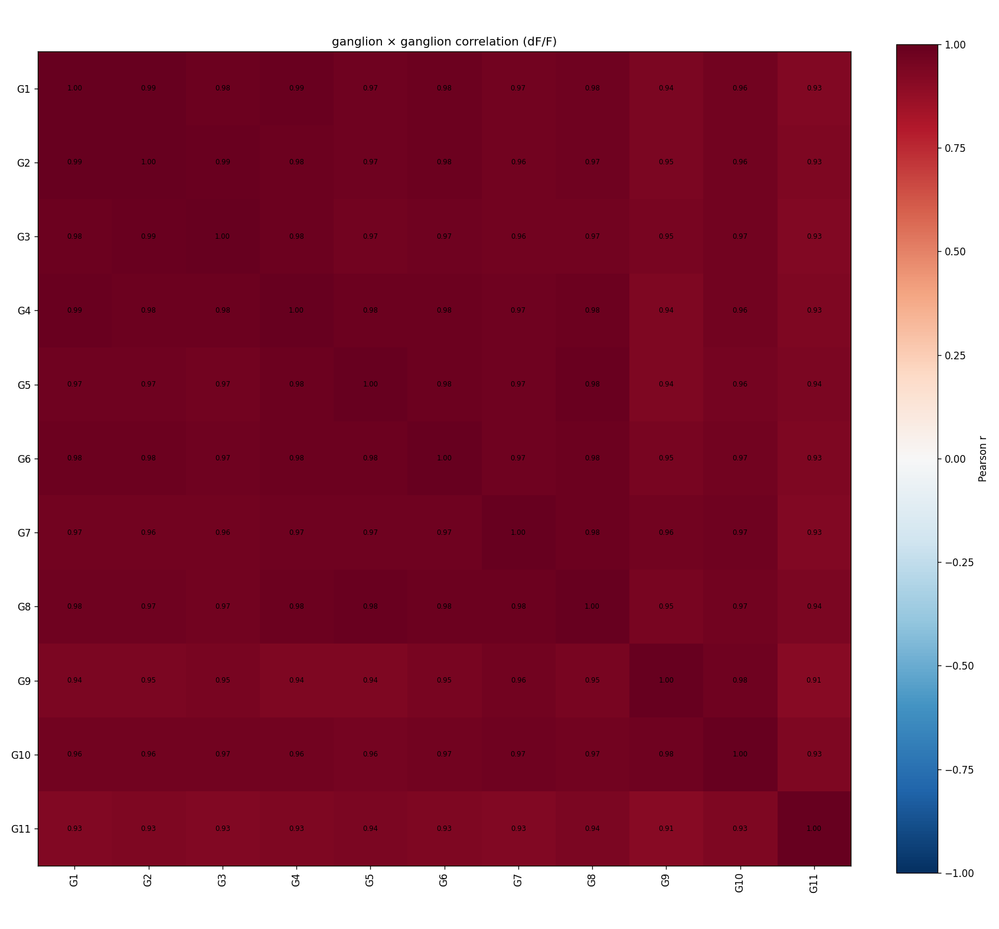

- **What.** Pearson correlation between every pair of ganglion ΔF/F traces.
- **Read.** Diagonal = 1; off-diagonal dark red = +1 (together), white = 0, blue = −1 (opposite).
- **Interpret.** **Everything correlates 0.91–1.00** — *not* specific coupling, just one dominant shared (common-mode) signal. Mean off-diagonal r = **0.96**; PC1 = **97.5%** of variance across the 11 ganglion-mean traces. (These two are related summaries of the same dominance, not independent confirmations. PC1 also contains shared slow drift — see §8.) **Read naively, this plot is a trap.**

---

## 6. Propagation / lag — RAW

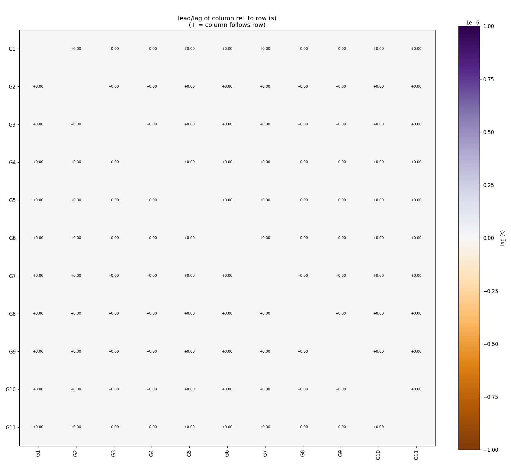

Cell [row, col] = time lag of the column ganglion relative to the row (sign = who leads). **All resolved lags are ~0** → no coarse propagation; consistent with synchrony. Caveat: lags are quantized to the ~0.35 s frame interval, so sub-frame leads can't be resolved.

---

## 7. Removing the global signal → the candidate structure

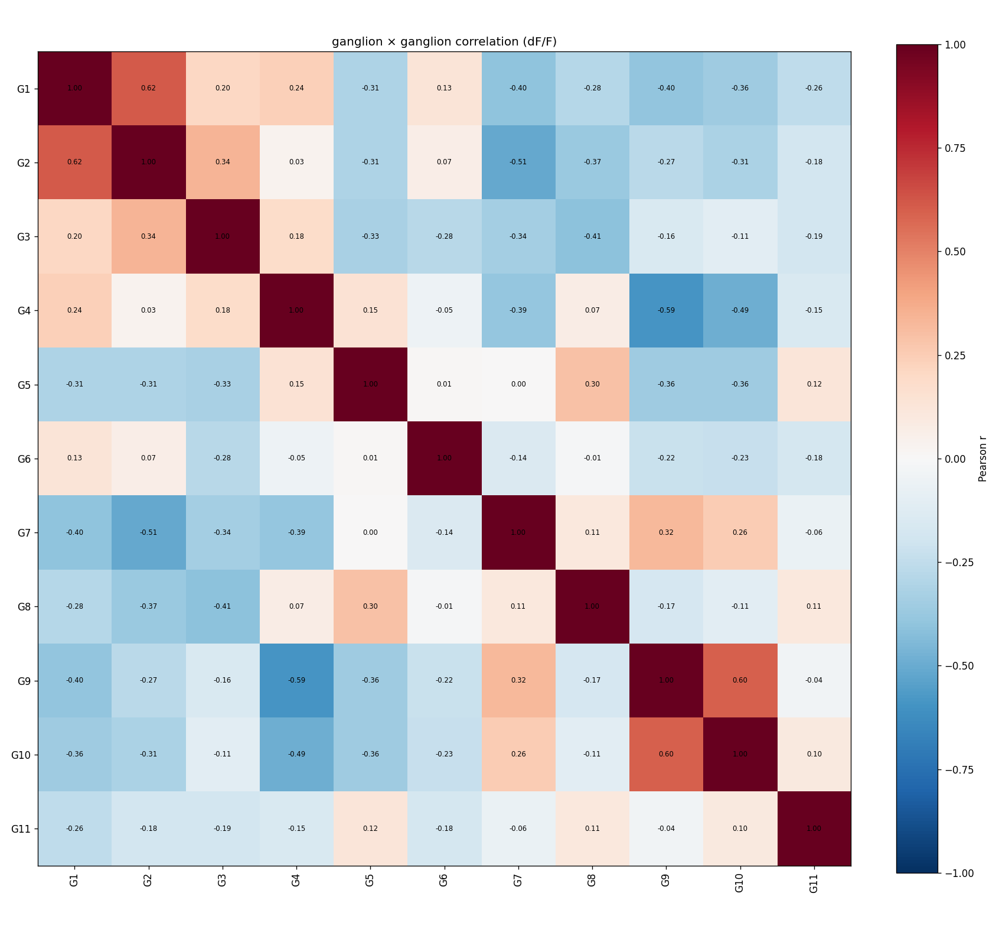

- **What.** Ganglion × ganglion correlation **after regressing out the shared common-mode signal** (`--remove-global`).
- **Read.** Same scale as §5, now showing genuinely co-active / anti-phase relationships once the rhythm is removed.
- **Interpret.** A structured pattern emerges (representative pairs, not standalone findings): **adjacent ganglia co-vary** (G1–G2 ≈ +0.62, G9–G10 ≈ +0.60); **anterior vs posterior anti-correlate** (G4↔G9 ≈ −0.59, G2↔G7 ≈ −0.51). It is **reproducible across ROI size** — the `small` and `full` residual matrices agree at **r = 0.82**.

**Trust level: candidate, not settled.** The residual is only ~3% of total variance. Two confounds remain: (1) regressing out the 11-trace mean imposes a negative-sum constraint, so *some* anti-correlation is expected by construction — though that effect (~−0.1 average) is far weaker than the −0.5/−0.6 pairs seen, so it biases but can't manufacture them; (2) shared slow drift is seen by both ROI sets, so cross-ROI agreement can't subtract it. A phase-shuffled / shared-component null and a drift control are the needed next tests.

---

## 8. What is the rhythm? — power spectrum

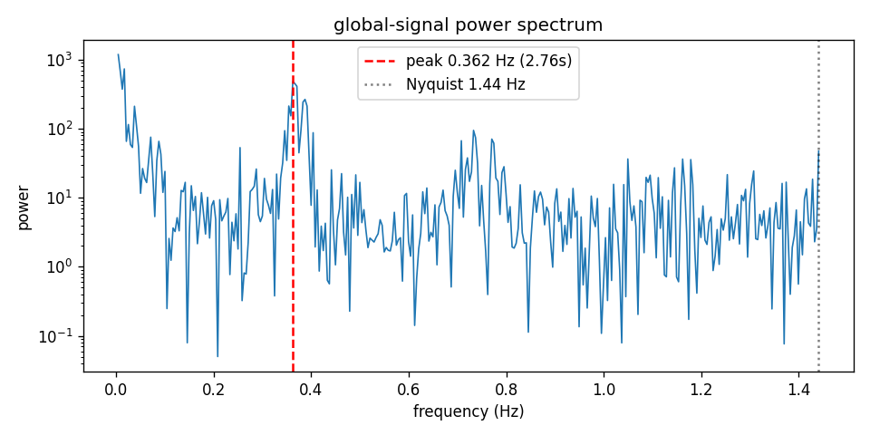

- **What.** Power spectrum of the global-mean (whole-frame brightness) trace.
- **Read.** X = frequency (dotted line = Nyquist 1.44 Hz); Y = power on a log scale (gridlines ×10). A tall narrow peak above the flat floor = a real rhythm; the rise near 0 Hz is slow drift/bleaching.
- **Interpret.** One narrow peak at **0.362 Hz (2.76 s period)**, ~2 log-decades above the floor; the 240 s record holds ~87 cycles, so it's well-sampled. For orientation only, that's faster than leech heartbeat (~0.1 Hz) and slower than swim (~1–2 Hz) — but those bands aren't validated for *Helobdella*, so they carry no inferential weight. GCaMP6m kinetics low-pass the signal, so 0.362 Hz is the dominant frequency of the *indicator*, not necessarily of firing.

---

## 9. Where & when it peaks — phase / amplitude maps

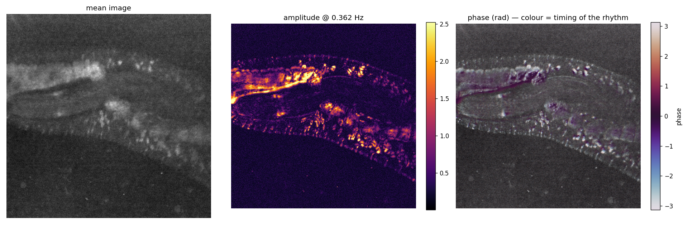

Per-pixel Fourier analysis at 0.362 Hz: *middle* = amplitude (oscillation strength), *right* = phase (timing within the cycle; opacity ∝ amplitude). **Amplitude confirms the rhythm lives on the cord/ganglia; the on-cord phase is nearly uniform** (≈0–70 ms spread, see §10) → near-synchronous, no obvious travelling wave. Read alongside §10, since the opacity weighting can hide phase in weak pixels.

---

## 10. Anterior–posterior propagation test

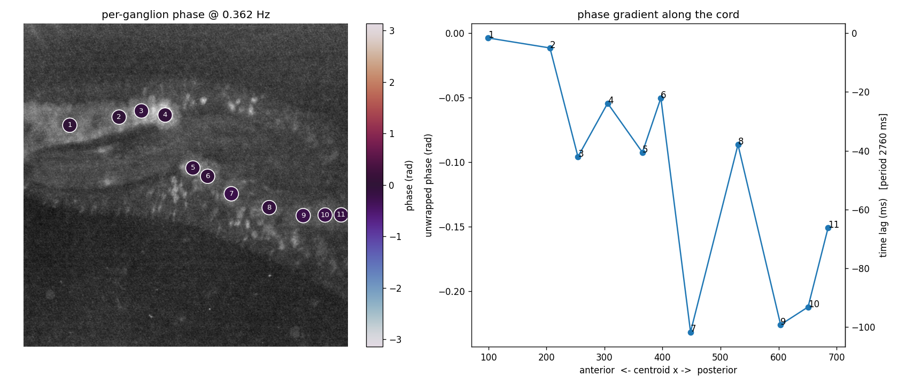

- **What.** *Left:* ganglia coloured by phase at 0.362 Hz. *Right:* phase vs anterior→posterior position (left axis = radians, right axis = the same as a time lag in ms).
- **Read.** A straight sloped line = a travelling wave; a flat line = synchronous.
- **Interpret.** The line is **nearly flat and non-monotonic** — the whole cord spans only **~0–70 ms** out of a 2760 ms cycle. That's *below* the ~350 ms sampling floor, so read it as an **upper bound consistent with synchrony**, not a measured lag. This corrects an earlier "travelling wave" guess: the §7 A–P anti-phase is **not** a phase gradient of this carrier — if real, it must be a separate, slower amplitude modulation.

---

## 11. Does it replicate? — batch across 15 recordings

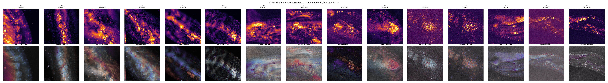

suite2p + phase analysis on 15 recordings (top = amplitude, bottom = phase; titles give peak frequency + synchrony metric; table in `_batch_phase_summary.csv`).

**Partial replication — a clear fast rhythm in only 3 of 15:** −13 (0.458 Hz), −14 (0.547 Hz), −17 (0.362 Hz). Seven long recordings are drift-dominated (0.02–0.04 Hz, no fast peak); four are too short (30–70 frames) to trust. Because the frequency **varies between recordings**, this argues **against a single fixed-frequency optical/illumination artifact** and is more consistent with an intermittent, state-dependent rhythm — but with only 3 examples it's suggestive, and it does **not** establish a *neural* origin (a non-neural rhythm — heartbeat, perfusion, vascular pulsation — could also vary in frequency).

---

## 12. Key findings

1. **One near-synchronous shared signal dominates**, dominant rhythmic component **~0.36 Hz**, across the whole cord (PC1 = 97.5% of variance across the 11 ganglion-mean traces; also contains slow drift). Raw correlations (~0.96) reflect only this and say nothing about specific coupling.
2. **No detectable A–P propagation**: ≤~70 ms end-to-end spread is below the ~350 ms floor — an upper bound consistent with synchrony, not a measured lag.
3. After removing the global signal, a **small, reproducible** candidate structure remains (adjacent co-vary, A–P anti-correlate; cross-ROI r = 0.82) — pending a regression-null + drift control. A slow amplitude modulation, not a phase gradient.
4. Across 15 recordings the rhythm is **intermittent and variable in frequency** (0.36–0.55 Hz in 3, absent in the rest) — argues against a fixed-frequency artifact, but does not establish a biological (let alone neural) origin.

## 13. Caveats

- **Widefield, not 2-photon** — out-of-focus background / neuropil mixing.
- **2.88 Hz sampling** — lags quantized to ~0.35 s; sub-frame leads and fast waves unresolved.
- **Common-mode regression** imposes a negative-sum constraint → some anti-correlation by construction; §7 is trusted only as far as it reproduces across ROI sizes (validates pattern, not induced-vs-genuine).
- **GCaMP6m kinetics** low-pass the signal — the 0.36 Hz peak it can still track with modest attenuation; faster structure is blurred.
- **Photobleaching / slow drift** contaminates low frequencies, including the ~3% residual that §7 treats as the finding.
- **Residual-motion control not yet run** — the 0.362 Hz signal was never correlated against frame-by-frame registration offsets (the most direct test that it isn't sub-pixel motion).
- **No formal significance testing**; strong temporal autocorrelation means effective d.o.f. ≪ 692, so every r is descriptive. "Reproducible" rests on the single cross-ROI r = 0.82.
- **Single prep / recording** — the §7 result rests on −17 alone; the 14 other registered recordings aren't yet annotated/residual-analysed (next step).
- **Rhythm identity** (heartbeat / bursting / optical) **not yet established**.

## 14. Reproduce

```bash
python scripts/run_suite2p.py data/calcium/2026-06-04/helobdella_LeechNo2_elavgcamp6m-17.tif   # register
python -m analysis.calcium.annotate_ganglia data/calcium/runs/<stem> --set full                # annotate
python -m analysis.calcium.ganglion_activity data/calcium/runs/<stem> <regions>/small           # raw analysis
python -m analysis.calcium.ganglion_activity data/calcium/runs/<stem> <regions>/small --remove-global  # residual
python -m analysis.calcium.phase_analysis    data/calcium/runs/<stem> <regions>/small           # spectrum + phase
python -m analysis.calcium.render_overlay    data/calcium/runs/<stem> <regions>                 # overlay video
python scripts/batch_phase.py                                                                   # batch
```

## 15. File map

- `analysis/calcium/`: `signals.py` (load/ΔF/F/maps), `annotate_ganglia.py` (napari ROI sets), `ganglion_activity.py` (correlation/lag/events + `--remove-global`), `phase_analysis.py` (spectrum/phase), `render_overlay.py` (video).
- `scripts/run_suite2p.py`, `scripts/batch_phase.py` — single + batch drivers; `tests/test_calcium_analysis.py` — unit tests.
- Results: `analysis/calcium/regions/<stem>/{full,small}/{results,results_residual,phase}/`; batch: `data/calcium/runs/_batch_phase_montage.png`, `_batch_phase_summary.csv`.
