# Figure guide: calcium imaging of helobdella_LeechNo2_elavgcamp6m-17

A plot-by-plot walkthrough of every figure in `plots/`. For each one: what the
analysis is, how it was computed, and how to read it. Open this file in a Markdown
viewer from inside `analysis_calcium/` so the inline images resolve.

## The recording in one paragraph

Pan-neuronal GCaMP6m (elav promoter) in a juvenile *Helobdella* leech ganglion,
imaged at 10x on a confocal. 692 frames, 700x700 px, single channel, frame rate
**fs = 2.882 Hz** (0.347 s/frame), total ~240 s. Annotated "10x juvenile after
dopamine pharyngals", movement "no". Because it is low magnification and a preliminary
line, everything is interpreted at the **ganglion / regional** level, not as single
neurons. The dominant phenomenon is a single, strong, clock-like, ganglion-wide
calcium oscillation at **0.372 Hz (period 2.69 s)** that is sustained for the whole
recording and synchronous across the ganglion.

## How the numbers are produced (shared definitions)

- **dF/F**: for each region/patch, F0 is a rolling 10th-percentile baseline (~60 s
  window); dF/F = (F - F0) / F0. Neuropil was subtracted (F - 0.7*Fneu) before this.
- **Ganglion signal**: mean raw F inside a tissue mask (the bright ganglion band),
  converted to dF/F. This is the primary high-level trace (`derived/ganglion_signal.npy`).
- **Patches**: 180 ROIs from a correlation-image blob+watershed segmentation (the
  primary set). suite2p's 24 ROIs are kept as a cross-check. At 10x these are "active
  patches", not single cells.
- **Dominant frequency**: peak of the Welch power spectrum of the ganglion signal.
- **Cycle peaks**: scipy find_peaks on the ganglion signal; 88 cycles detected.

---

# Stage 1: quality control and motion

### s1_projections.png
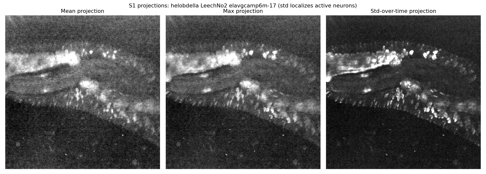

- **What**: three summary images of the movie collapsed over time: the mean, the
  maximum, and the standard deviation at each pixel.
- **How**: per-pixel mean/max/std across all 692 frames, with percentile contrast.
- **How to read**: the mean shows anatomy (where tissue is). The **std** image is the
  most useful: bright pixels are where intensity *changes* over time, i.e. active
  neurons. Here the std and max highlight a ganglionic band in the upper-central field.

### s1_correlation_image.png
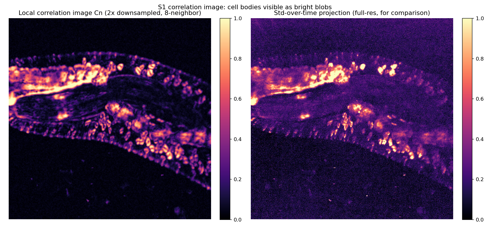

- **What**: the local correlation image (Cn), the cleanest map of cell bodies, beside
  the std projection.
- **How**: each pixel's average temporal correlation with its 8 neighbors. Cells, whose
  pixels rise and fall together, light up; uncorrelated background stays dark.
- **How to read**: bright blobs = candidate somata. This image seeds segmentation. The
  bright band is the ganglion; the dim periphery is background.

### s1_brightness_bleach.png
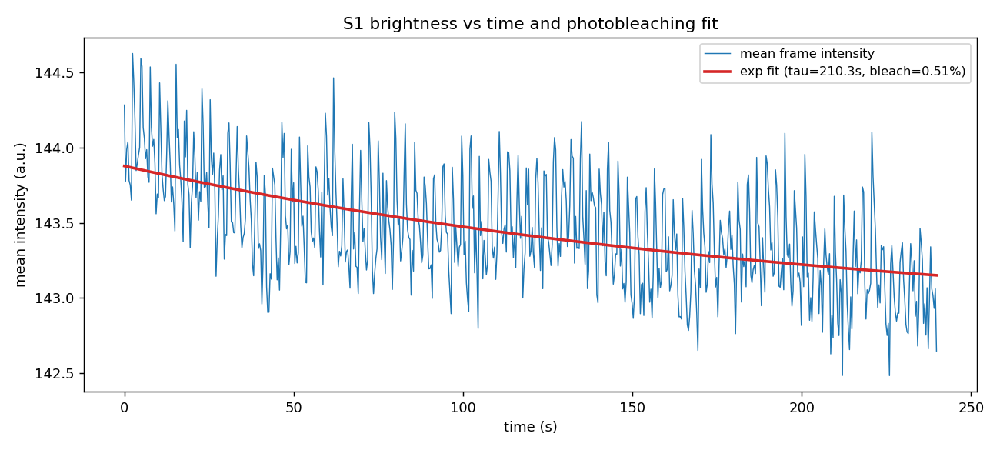

- **What**: photobleaching check.
- **How**: mean frame intensity vs time (all 692 frames) with an exponential-decay fit.
- **How to read**: a steep downward curve would mean bleaching that needs detrending.
  Here the line is nearly flat (**~0.5% loss over 240 s**), so no detrending is
  needed; dF/F absorbs it.

### s1_motion.png
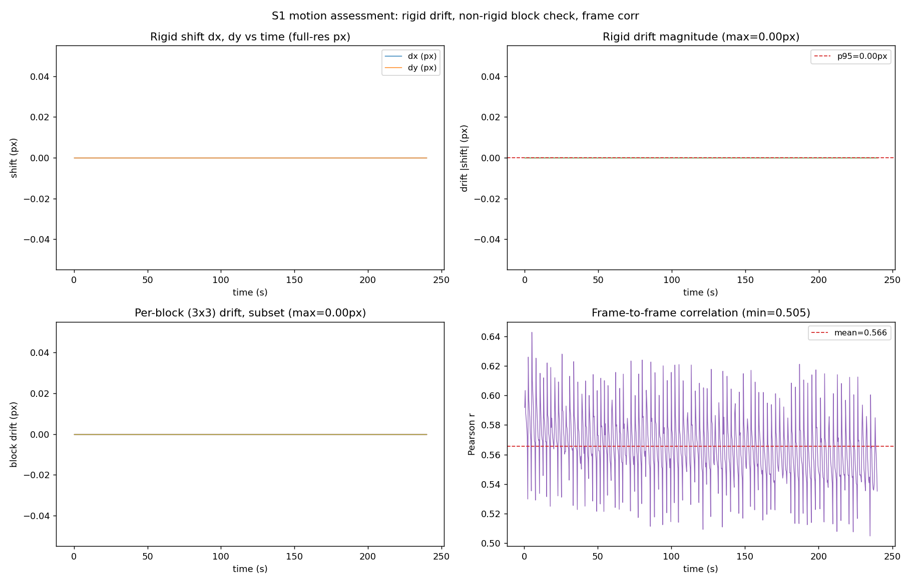

- **What**: the motion-correction decision evidence.
- **How**: rigid frame-to-reference drift via phase cross-correlation for every frame
  (dx, dy, magnitude); a 3x3 block-wise drift check for non-rigid jitter; and
  frame-to-frame correlation over time.
- **How to read**: drift traces flat at **0 px** = no translation; flat block drift = no
  local warping. The conclusion is **no motion correction needed**. The ~0.55
  frame-to-frame correlation reflects real calcium dynamics, not motion (do not mistake
  it for a motion problem).

---

# Stage 2 and 2b: segmentation and signal extraction

### s2_rois_on_mean.png
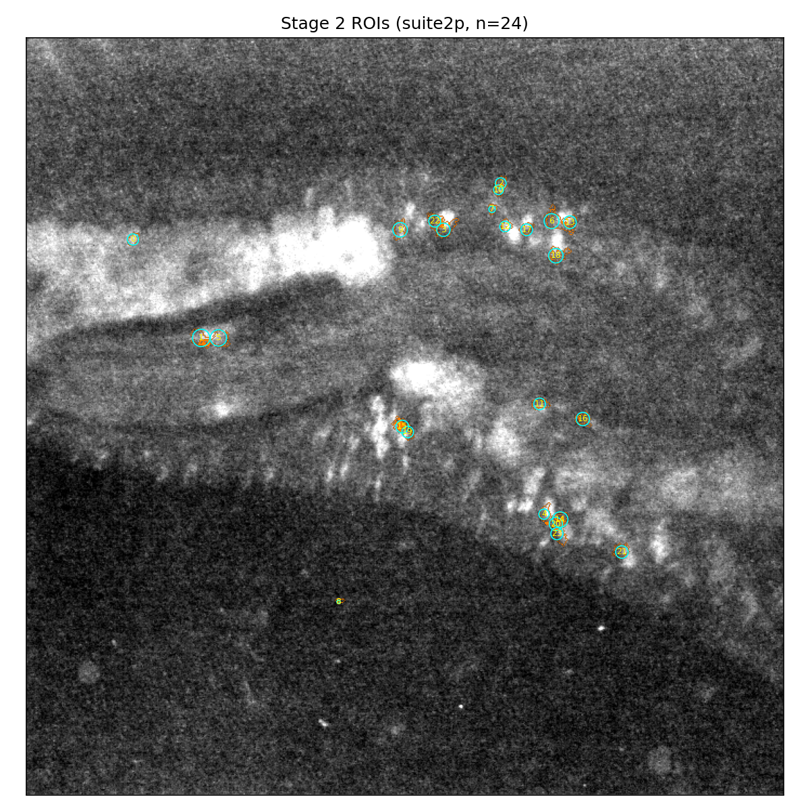

- **What**: suite2p's detected ROIs (n = 24) on the mean image.
- **How**: suite2p run with registration on, tau 1.0, diameter 15, relaxed threshold.
- **How to read**: each circle is an accepted ROI. Note how **few** there are relative
  to the visible somata, which motivated the alternative method below.

### s2_example_traces.png
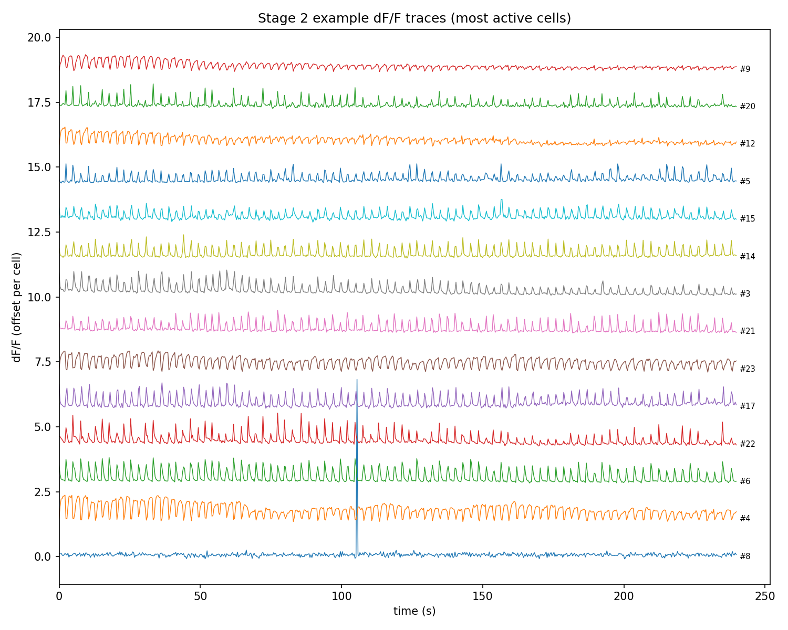

- **What**: dF/F traces of the most active suite2p ROIs, stacked with vertical offsets.
- **How to read**: x is seconds; each row is one ROI. The regular up-down ripples are
  the calcium rhythm; nearly every ROI shows it.

### s2_registration_check.png
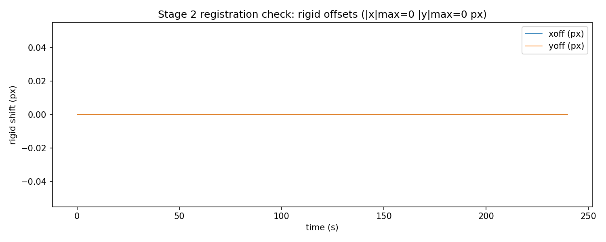

- **What**: confirmation that registration was a no-op.
- **How**: suite2p rigid x/y offsets per frame.
- **How to read**: both traces flat at 0 = the algorithm found nothing to correct,
  independently confirming Stage 1's "no motion".

### s2b_rois_on_corr.png
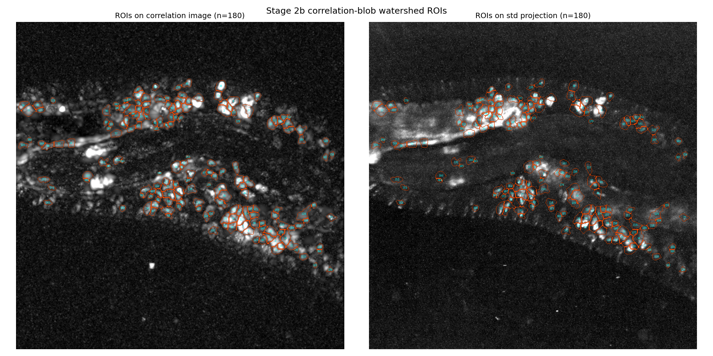

- **What**: the primary segmentation, 180 ROIs from correlation-blob + watershed.
- **How**: detection image = normalized correlation image x std projection; tissue mask
  by Otsu; soma seeds by peak_local_max (min distance ~ soma radius); watershed to split
  touching somata; filtered by area and brightness.
- **How to read**: numbered outlines tile the active ganglion band. This is 7.5x more
  ROIs than suite2p and is the set used for all downstream patch analyses.

### s2b_method_comparison.png
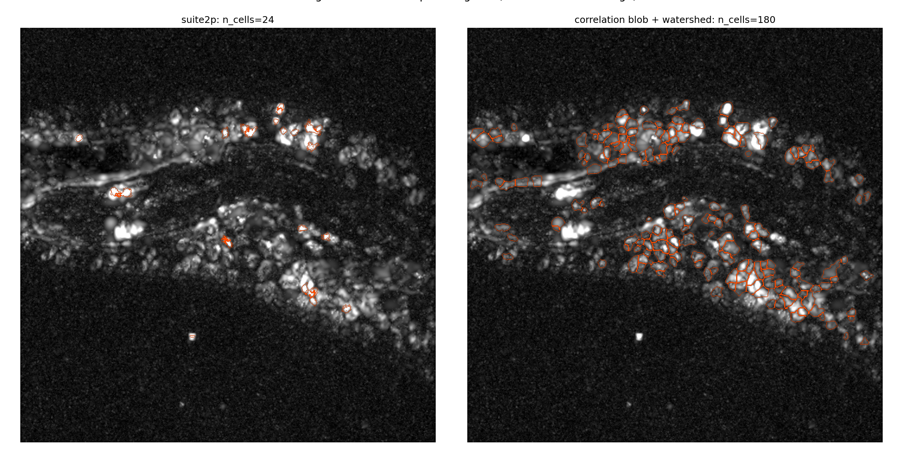

- **What**: suite2p (24) vs correlation-blob (180) side by side on the same image.
- **How to read**: the under-segmentation by suite2p is visually obvious; the blob method
  covers cells suite2p left empty. Both still recover the same rhythm, so the result does
  not depend on the choice.

### s2b_example_traces.png
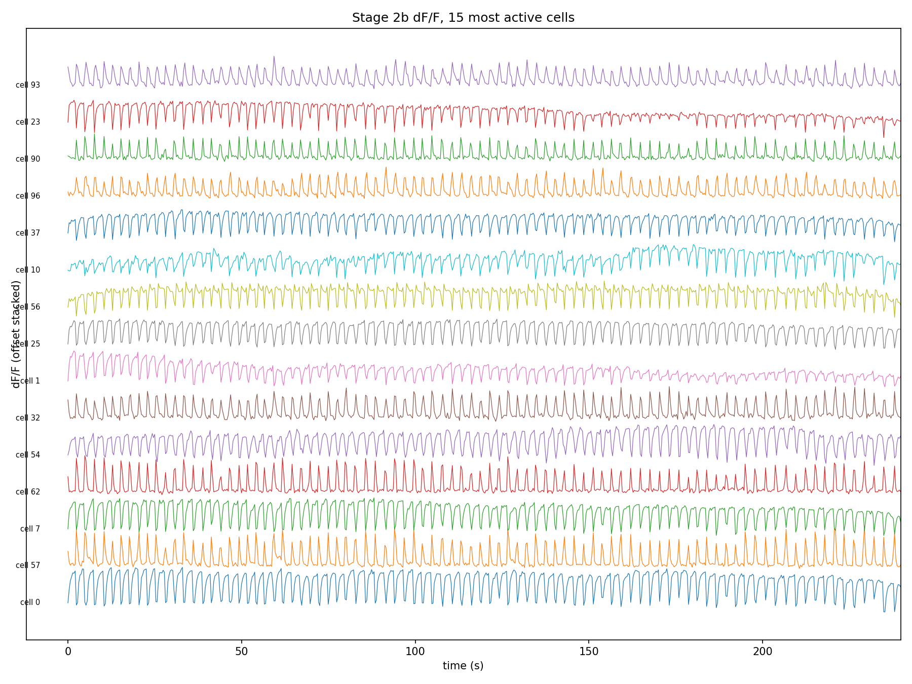

- **What**: dF/F of the 15 most active patches from the primary method.
- **How to read**: stacked traces in seconds; the shared, near-identical ripple across
  rows is the ganglion-wide rhythm.

---

# Stage 3: temporal structure of the rhythm

### s3_ganglion_signal.png
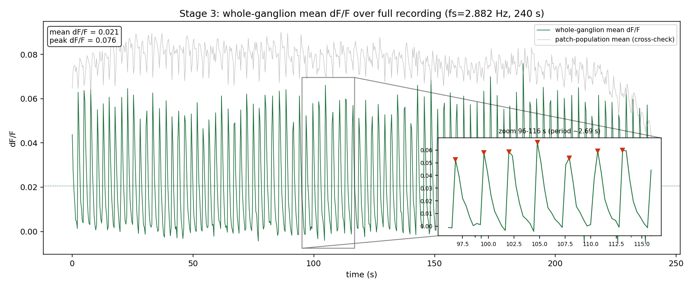

- **What**: the whole-ganglion mean dF/F over the full recording, with a 20 s zoom inset.
- **How to read**: the sustained regular oscillation runs the entire 240 s without
  damping; the inset shows the waveform shape of single cycles. Peak dF/F ~0.08 (modest,
  expected for 10x bulk imaging).

### s3_spectrum.png
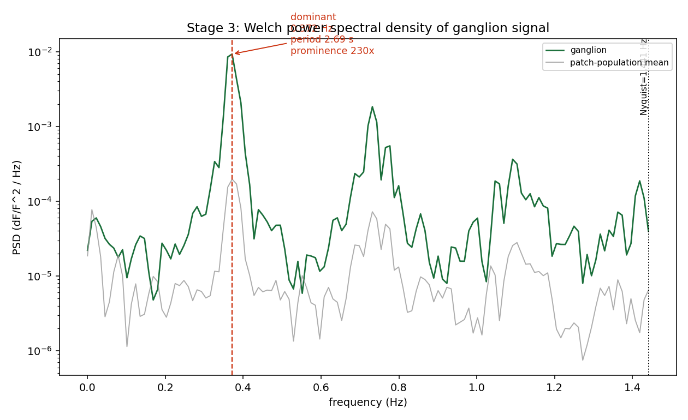

- **What**: Welch power spectral density of the ganglion signal (and patch-population
  mean).
- **How to read**: the sharp peak at **0.372 Hz** is the rhythm; the smaller bump at
  ~0.73 Hz is its harmonic (proof the waveform is periodic but not a pure sinusoid). The
  peak stands ~230x above the broadband floor. The dotted Nyquist line (1.44 Hz) is far
  to the right, so the fundamental is not aliased.

### s3_spectrogram.png
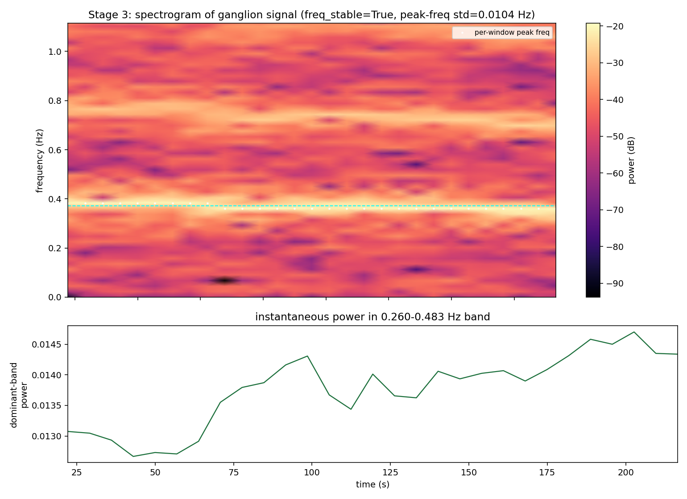

- **What**: how the frequency content evolves over time.
- **How**: sliding-window FFT (time on x, frequency on y, power as color).
- **How to read**: a single horizontal band fixed at ~0.37 Hz across the whole recording
  means the rhythm is **frequency-stable, not drifting**.

### s3_autocorr_regularity.png
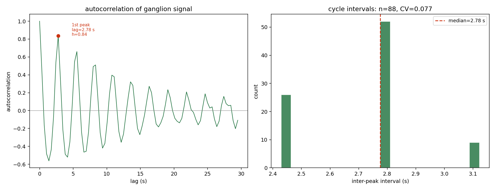

- **What**: how clock-like the rhythm is.
- **How**: autocorrelation of the ganglion signal plus the distribution of inter-peak
  intervals.
- **How to read**: tall, evenly spaced autocorrelation side-peaks = strong periodicity;
  the first side-peak at ~2.78 s matches the cycle period (the spectral period is 2.69 s).
  The tight interval histogram (CV 0.077) confirms very low cycle-to-cycle jitter.

### s3_regional_comparison.png
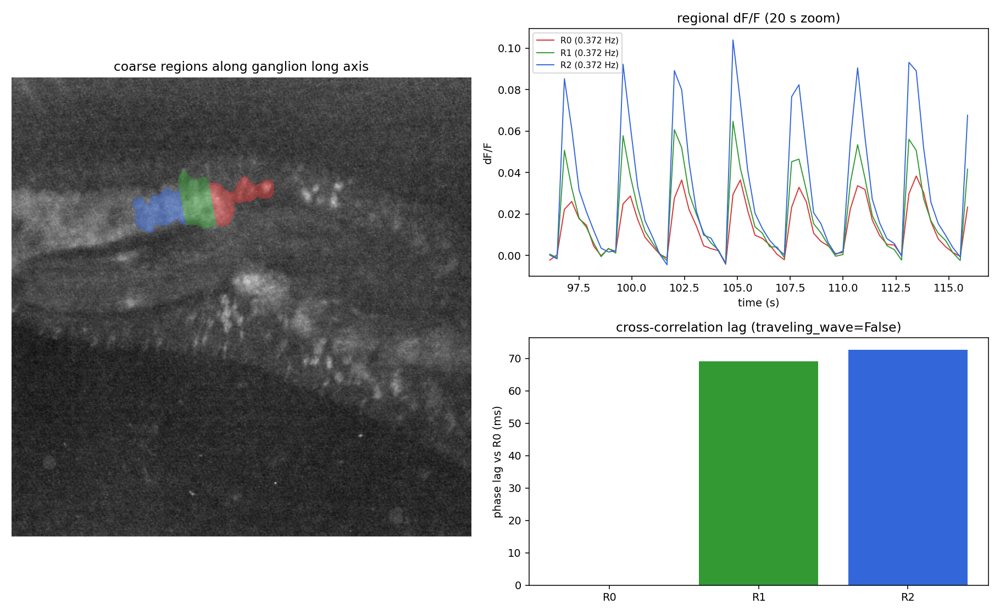

- **What**: do coarse parts of the ganglion share the rhythm and its timing.
- **How**: split the band into a few regions (anterior/mid/posterior), compare their
  traces, frequencies, and cross-correlation phase lags.
- **How to read**: identical frequencies and sub-frame (~70 ms) lags = the regions are
  synchronous, with no traveling-wave gradient.

---

# Stage 4: spatial structure of the rhythm

### s4_activity_maps.png
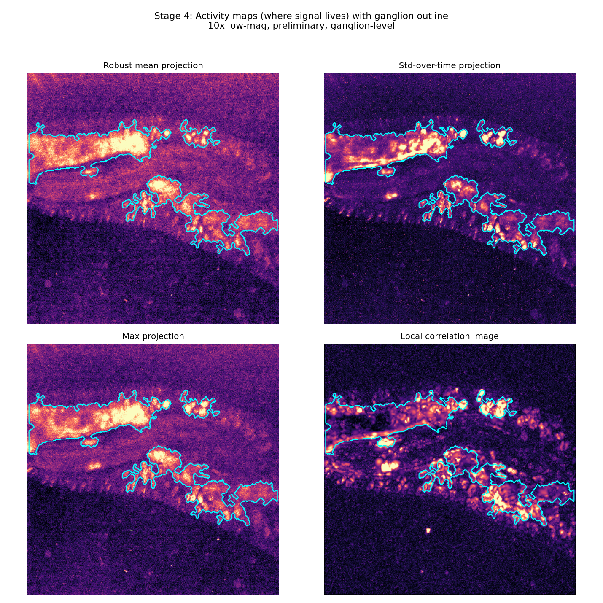

- **What**: where signal lives, as a panel of mean / std / max / correlation projections
  with the ganglion outline.
- **How to read**: signal is confined to the elongated ganglion band (~13% of the field);
  the periphery is background.

### s4_pixelwise_rhythm_power.png
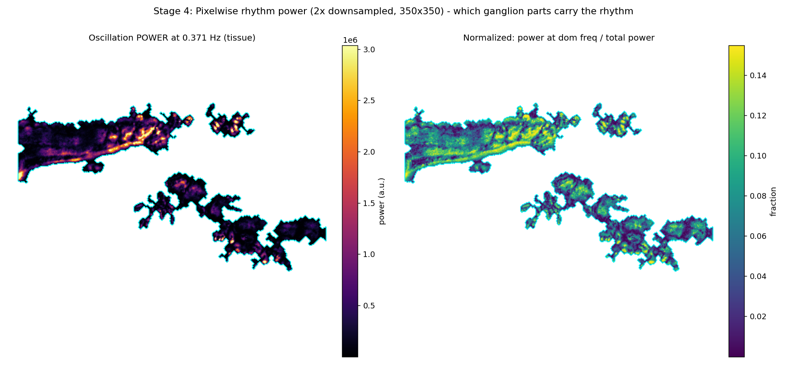

- **What**: which pixels carry the 0.37 Hz rhythm.
- **How**: per-pixel FFT power at the dominant frequency (left absolute, right normalized
  by total power).
- **How to read**: bright = oscillating at 0.37 Hz. The rhythm is spread across the whole
  band (~93% of tissue pixels), not localized to one spot.

### s4_phase_map.png
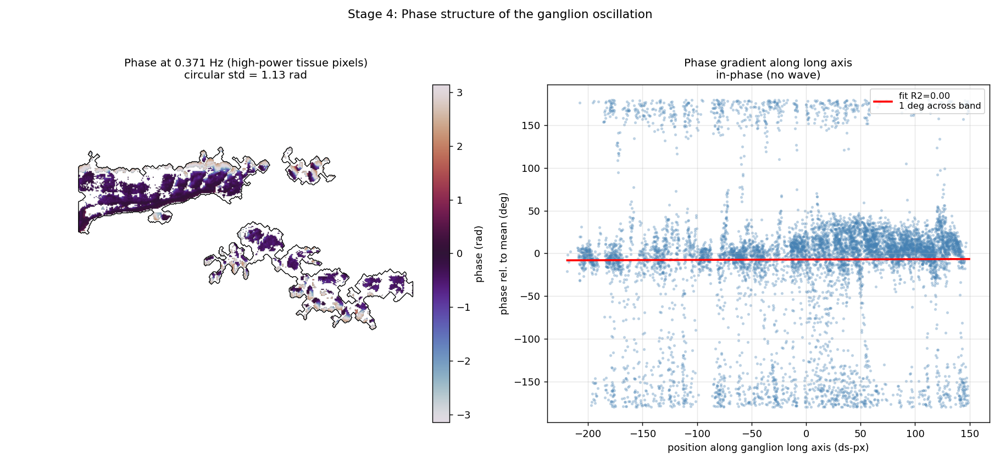

- **What**: the timing (phase) of the oscillation across space.
- **How**: angle of each pixel's FFT coefficient at 0.37 Hz, cyclic colormap, masked to
  high-power tissue.
- **How to read**: roughly uniform color = the ganglion oscillates in phase. A smooth
  color gradient would indicate a traveling wave; here there is none.

### s4_regional_correlation.png
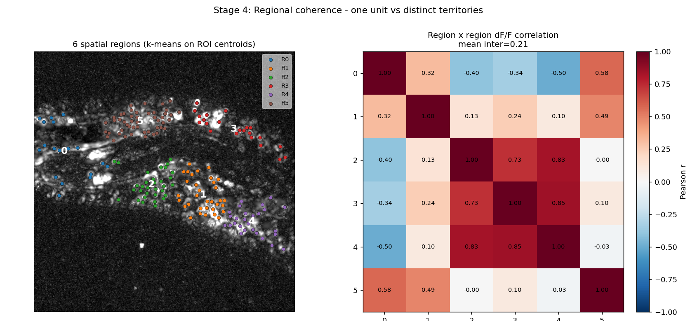

- **What**: are there distinct functional territories.
- **How**: tile the tissue into ~6 regions, correlate their mean traces.
- **How to read**: mostly positive correlations = one coherent rhythm; the spread (some
  weak/negative pairs) reflects varying signal-to-noise, not clean separate modules.

### s4_peak_trough_frames.png
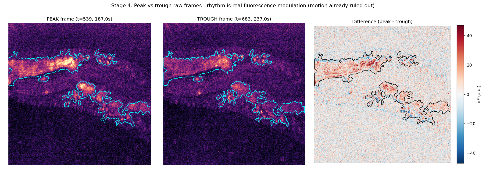

- **What**: a sanity check that the rhythm is real fluorescence, not noise.
- **How**: a raw frame at an oscillation peak, one at a trough, and their difference.
- **How to read**: the ganglion is uniformly brighter at the peak; the positive
  difference image confirms a genuine brightness modulation (motion already excluded).

---

# Intricate set: population / temporal (`fig_pop_*`)

### fig_pop_raster.png
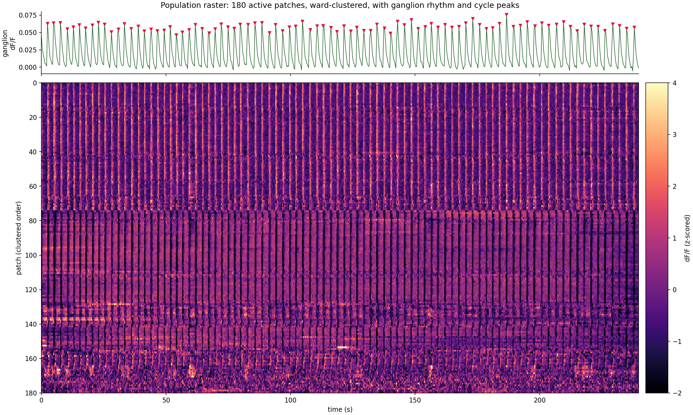

- **What**: the whole population at a glance.
- **How**: heatmap of all 180 patch dF/F (z-scored per patch), patches ordered by ward
  hierarchical clustering on correlation distance; the ganglion mean with cycle peaks
  runs along the top.
- **How to read**: each row is a patch, x is time. Vertical banding that lines up across
  rows = synchronized activity. The clustering groups patches with similar time courses.

### fig_pop_cycle_average.png
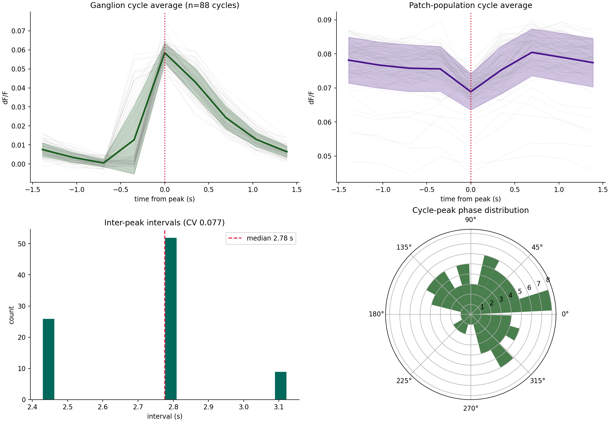

- **What**: the average shape of one oscillation cycle.
- **How**: cut the signal into windows centered on each detected peak, overlay all 88
  cycles (grey) and their mean +/- std (bold); plus the peak-phase histogram and a polar
  plot.
- **How to read**: tight overlap of the grey traces = highly reproducible waveform. The
  mean cycle shows the rise/fall asymmetry. The polar plot shows peak timing concentration.

### fig_pop_instantaneous.png
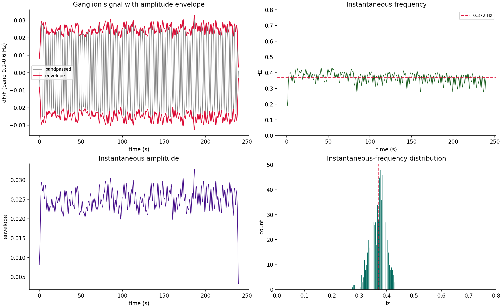

- **What**: instantaneous amplitude and frequency via the Hilbert transform.
- **How**: bandpass the ganglion signal 0.2 to 0.6 Hz, take the analytic signal; envelope
  = amplitude, derivative of phase = instantaneous frequency.
- **How to read**: the instantaneous frequency hugging 0.37 Hz (panel b and its
  histogram) is strong evidence of a stable single oscillator; the envelope (panels a, c)
  shows slow amplitude waxing and waning.

### fig_pop_interval_dynamics.png
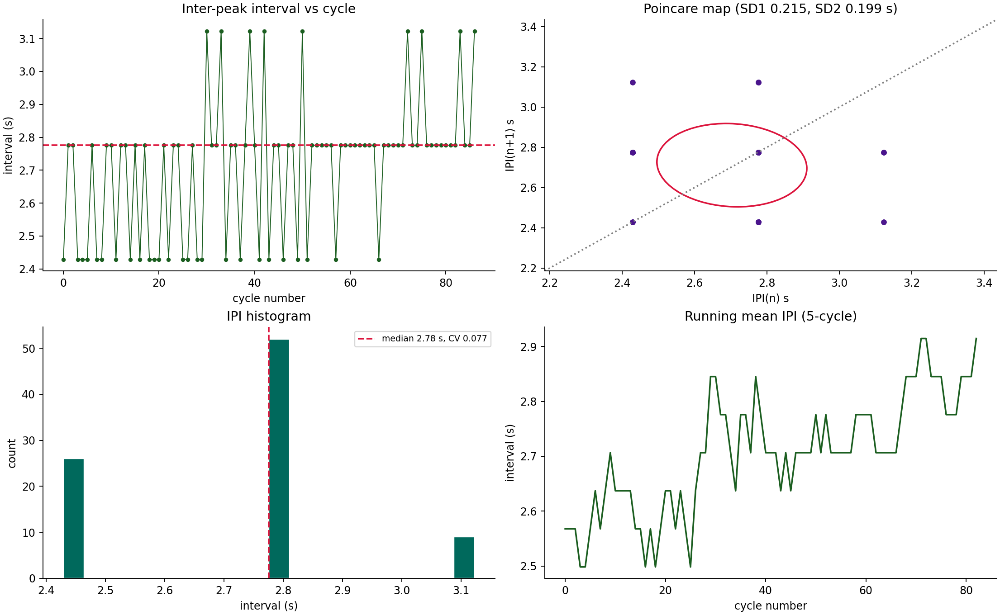

- **What**: cycle-to-cycle timing regularity.
- **How**: inter-peak interval (IPI) vs cycle, a Poincare map (IPI n vs IPI n+1) with an
  SD1/SD2 ellipse, the IPI histogram, and a running mean.
- **How to read**: a tight cluster on the Poincare map and small SD1 = a very regular,
  low-jitter rhythm. SD1 is short-term variability, SD2 long-term.

### fig_pop_patch_overview.png
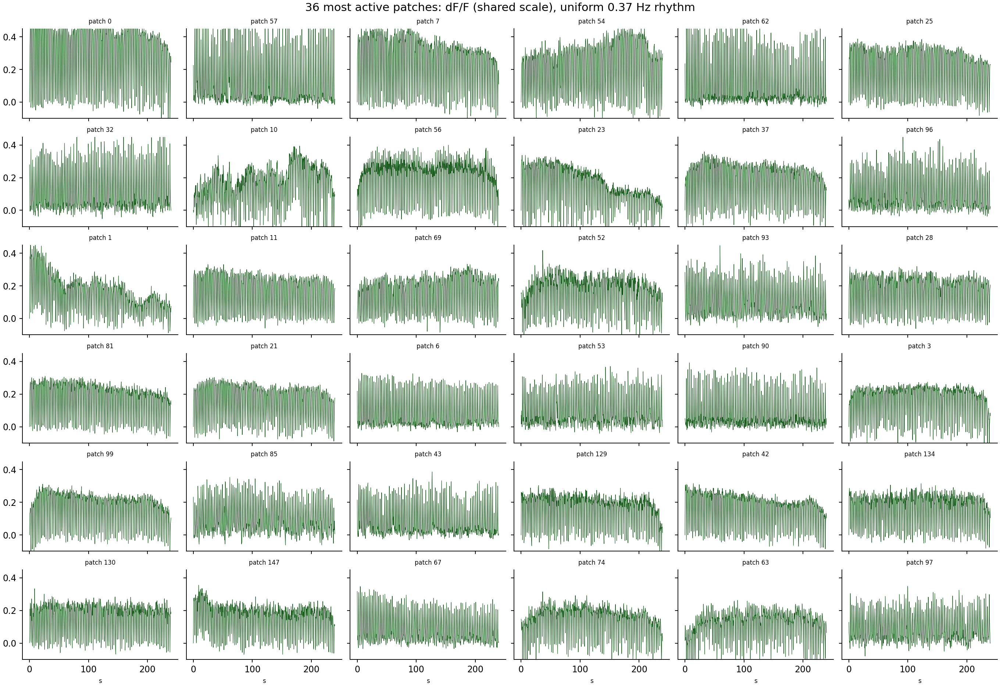

- **What**: small-multiples of the 36 most active patches.
- **How to read**: each mini-panel is one patch's dF/F on a shared scale. The rhythm
  looks nearly identical across panels, showing how uniform it is across the ganglion.

---

# Intricate set: spectral (`fig_spec_*`)

### fig_spec_psd_detailed.png
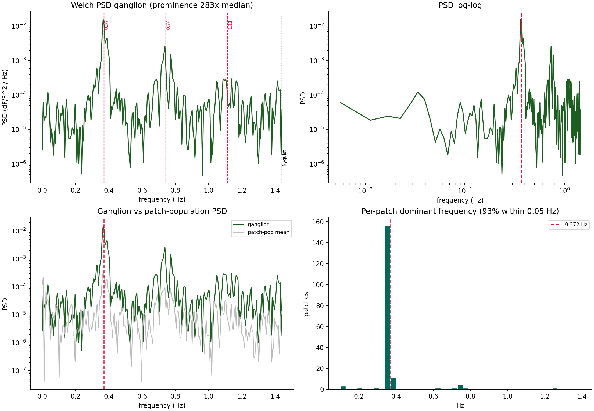

- **What**: a detailed look at the power spectrum.
- **How**: Welch PSD on linear-log and log-log axes, with fundamental and 2nd/3rd
  harmonics marked; ganglion vs patch-population overlay; and a histogram of each of the
  180 patches' own dominant frequency.
- **How to read**: the harmonic ladder confirms a periodic non-sinusoidal rhythm. The
  histogram shows **93% of patches peak within 0.05 Hz of 0.37 Hz**, i.e. they share one
  frequency.

### fig_spec_wavelet.png
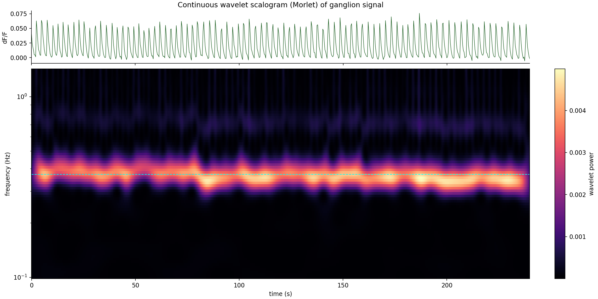

- **What**: a time-frequency (wavelet) view of the ganglion signal.
- **How**: a Morlet continuous wavelet transform (implemented manually); the raw signal
  is aligned above it.
- **How to read**: a continuous bright horizontal stripe at 0.37 Hz for the full duration
  = the rhythm is present and stationary the entire time (complements the spectrogram with
  better low-frequency resolution).

### fig_spec_spectrogram_detailed.png
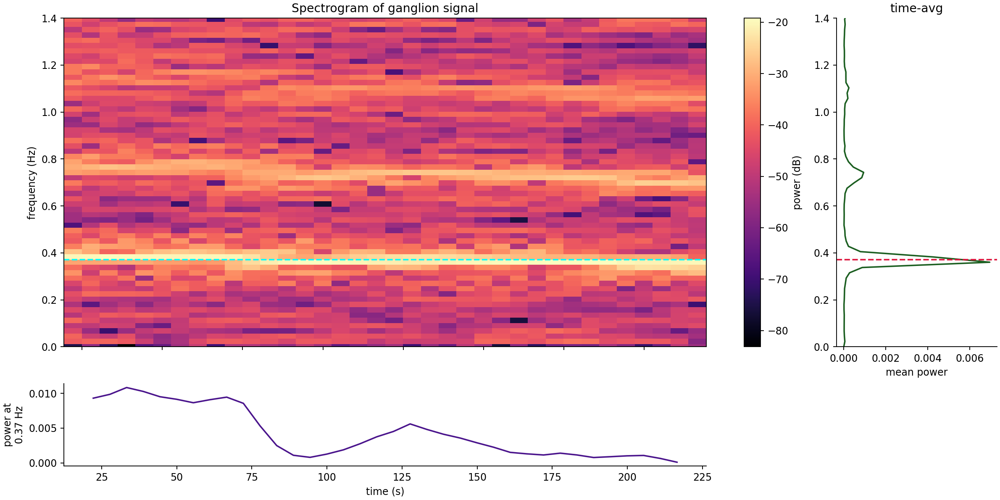

- **What**: a high-resolution spectrogram with marginal summaries.
- **How**: scipy spectrogram with generous overlap; side panel = time-averaged spectrum,
  bottom panel = power at 0.37 Hz over time.
- **How to read**: stable horizontal band = fixed frequency; the bottom panel shows how
  the rhythm's strength fluctuates mildly over the recording.

### fig_spec_coherence.png
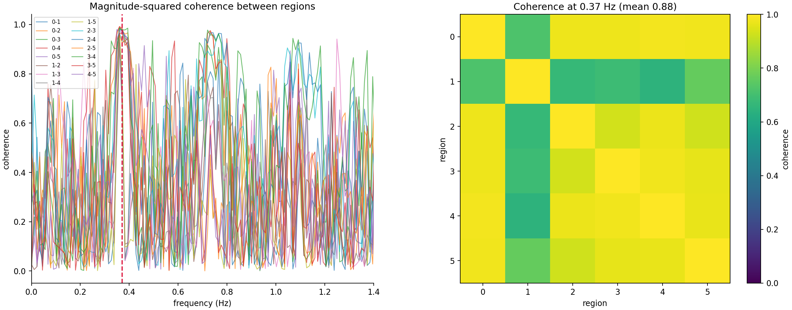

- **What**: how strongly separated regions oscillate together, frequency by frequency.
- **How**: magnitude-squared coherence between 6 spatial region pairs, plus a matrix of
  coherence at 0.37 Hz.
- **How to read**: coherence near 1 at 0.37 Hz (mean ~0.88) means the regions are tightly
  phase-locked at the rhythm frequency, even though individual noisy patches are not.

### fig_spec_patch_spectra.png
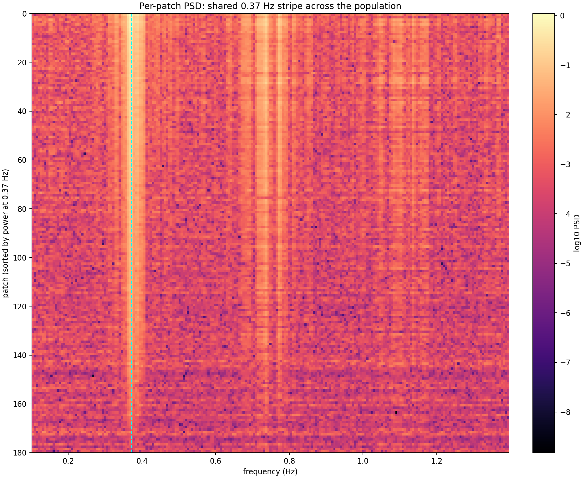

- **What**: every patch's spectrum stacked into one image.
- **How**: rows = 180 patches (sorted by power at 0.37 Hz), columns = frequency, color =
  log power; a vertical line marks 0.37 Hz.
- **How to read**: a sharp vertical stripe at 0.37 Hz shared down the rows = the whole
  population carries the same rhythm.

---

# Intricate set: spatial (`fig_spatial_*`)

### fig_spatial_power_phase.png
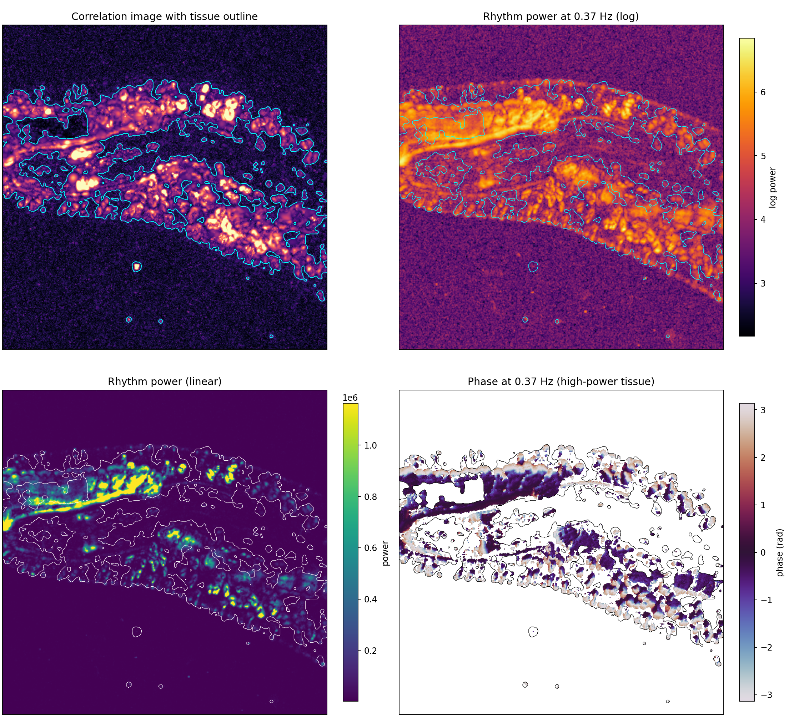

- **What**: a 2x2 of correlation image, rhythm power (log and linear), and phase.
- **How to read**: power panels show where the rhythm is strong; the phase panel (cyclic
  colors) is fairly uniform over the band = in-phase oscillation.

### fig_spatial_roi_properties.png
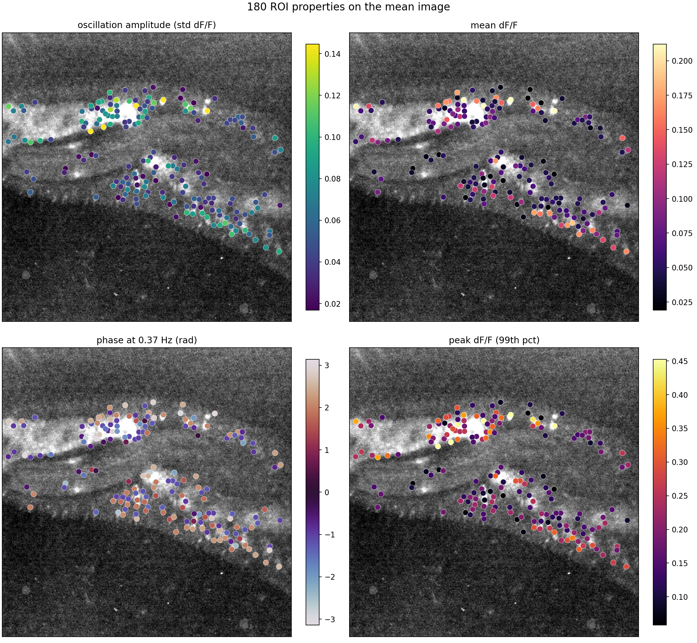

- **What**: the 180 ROIs colored by four properties on the anatomy.
- **How**: amplitude (std dF/F), mean dF/F, phase at 0.37 Hz, and peak dF/F per ROI.
- **How to read**: the amplitude/peak panels show which patches drive the rhythm; the
  phase panel shows whether timing varies in space (it is largely uniform among the
  strong patches).

### fig_spatial_phase_gradient.png
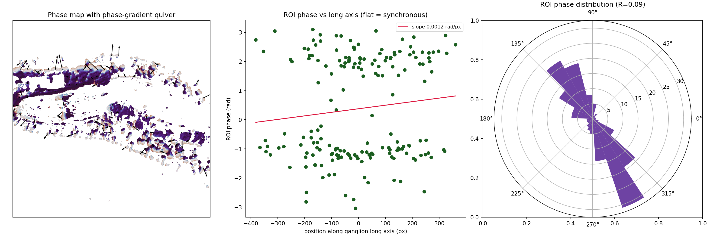

- **What**: an explicit traveling-wave test.
- **How**: phase map with a gradient quiver; ROI phase vs position along the ganglion long
  axis (PCA) with a regression slope; a polar histogram of ROI phases.
- **How to read**: a near-zero slope and no organized quiver direction = no traveling
  wave. Note the ROI phase histogram is fairly dispersed (resultant R ~0.09) because many
  weak patches have noisy phase; the strong patches and region averages are the coherent
  part.

### fig_spatial_seed_correlation.png
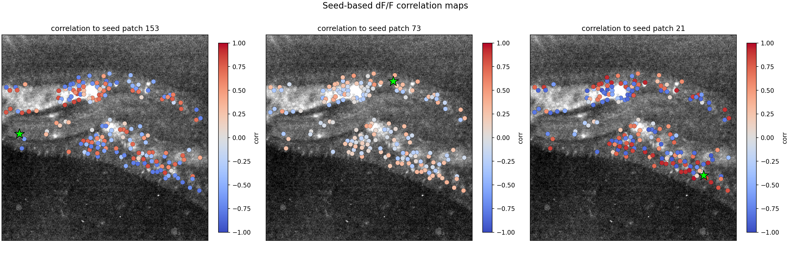

- **What**: how far co-activity reaches from a chosen patch.
- **How**: pick 3 seed ROIs in different regions; color all ROIs by their dF/F correlation
  to each seed.
- **How to read**: warm colors far from the seed = long-range coupling; here correlation
  is patchy rather than a smooth local halo, consistent with a global rhythm plus per-patch
  noise.

### fig_spatial_distance_correlation.png
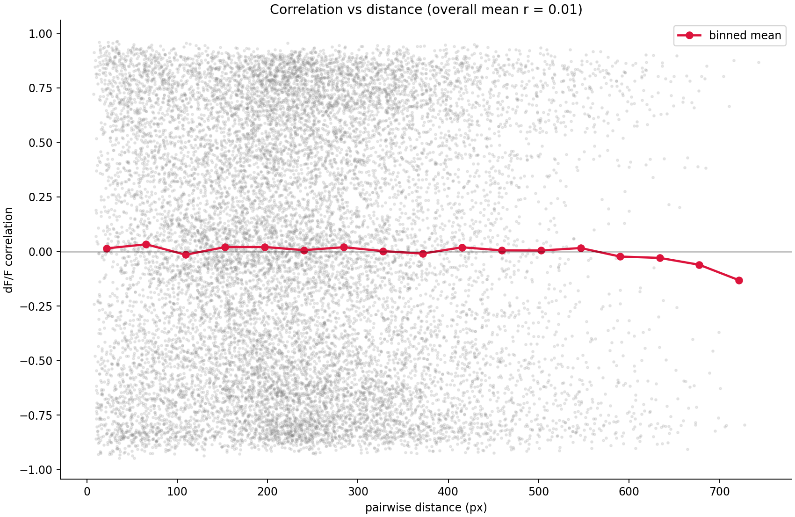

- **What**: does proximity predict co-activity.
- **How**: every patch-pair's correlation vs their centroid distance, with a binned-mean
  line.
- **How to read**: a flat binned line near zero = nearby patches are not much more
  correlated than distant ones, i.e. the coupling is global, not locally clustered (the
  overall pairwise mean is low because weak patches dominate the pair count).

---

# Intricate set: cycle-resolved spatiotemporal (`fig_cycle_*`)

### fig_cycle_phase_montage.png
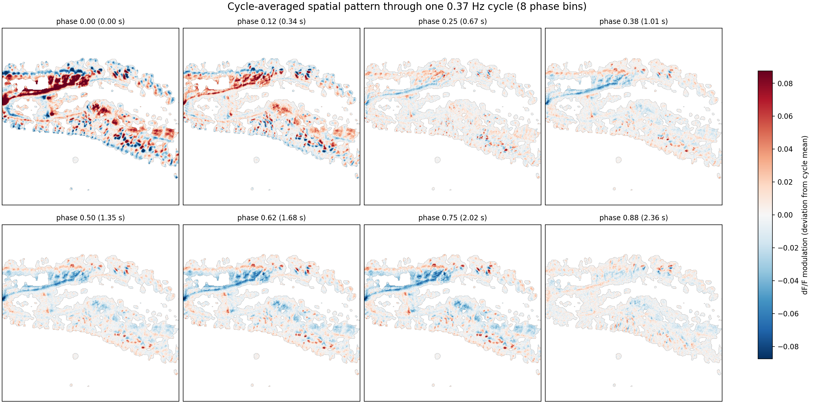

- **What**: one average oscillation cycle played out in space.
- **How**: assign every frame a phase 0 to 1 within its cycle, bin into 8 phases, average
  the frames in each bin, and show the deviation from the cycle mean (red = above, blue =
  below).
- **How to read**: the whole ganglion turns red together near phase 0 and blue together
  near phase 0.5 to 0.75. Brightening/dimming as a unit = a standing, synchronous
  oscillation, not a wave sweeping across.

### fig_cycle_kymograph.png
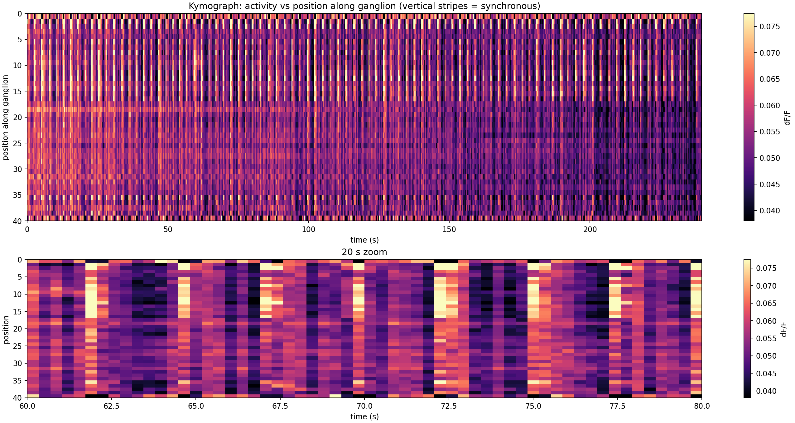

- **What**: space (along the ganglion) vs time, the clearest wave test.
- **How**: project activity onto 40 bins along the ganglion long axis; x = time, y =
  position, color = activity. A 20 s zoom is below.
- **How to read**: **vertical** stripes = all positions peak at the same time
  (synchronous). **Tilted** stripes would mean a traveling wave. Here the stripes are
  vertical.

### fig_cycle_peak_trough_gallery.png
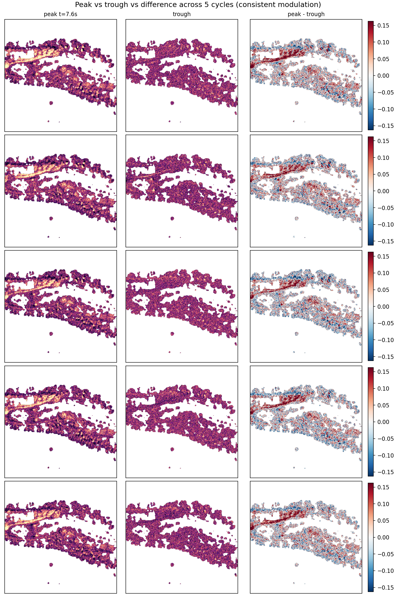

- **What**: cycle-to-cycle consistency of the spatial pattern.
- **How**: for 5 separate cycles, show the peak frame, the trough frame, and their
  difference.
- **How to read**: peaks brighter than troughs, and the difference maps (right column)
  showing the same positive pattern across all 5 rows = the modulation repeats reliably.

### fig_cycle_amplitude_map_over_time.png
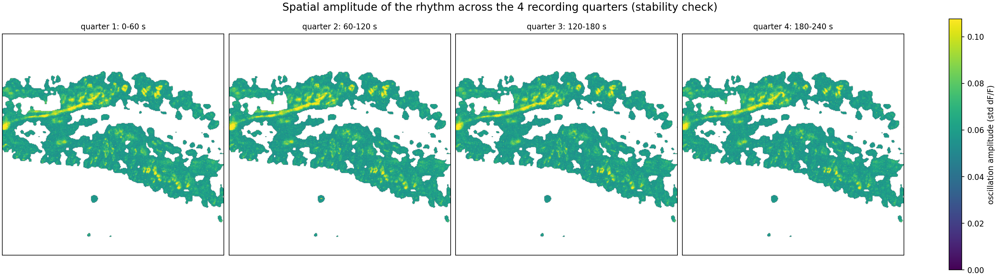

- **What**: is the rhythm's spatial amplitude stable over the recording.
- **How**: split into 4 equal time quarters; per-pixel oscillation amplitude (std over
  time) for each.
- **How to read**: similar maps across the four quarters = the rhythm neither grows nor
  fades nor moves over the 240 s.

### fig_cycle_movie.mp4

- **What**: the cycle-averaged sequence (the 8 phase bins above) looped a few times as a
  short movie.
- **How to read**: watch the ganglion pulse brighter and dimmer as a single unit; this is
  the rhythm in motion. (Open the mp4 directly; it is not an inline image.)

---

# Intricate set: dashboards and QC (`fig_dash_*`)

### fig_dash_master.png
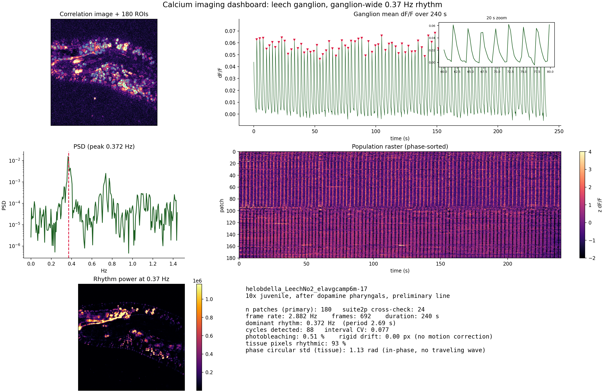

- **What**: the one-page summary of the whole analysis.
- **How**: combines the ROI map, ganglion trace with cycle peaks, PSD, phase-sorted
  population raster, rhythm power map, and a text block of key metrics.
- **How to read**: start here for the overview, then drill into the themed figures. The
  text panel lists n patches, frequency/period, CV, bleaching, drift, and phase spread.

### fig_dash_segmentation_compare.png
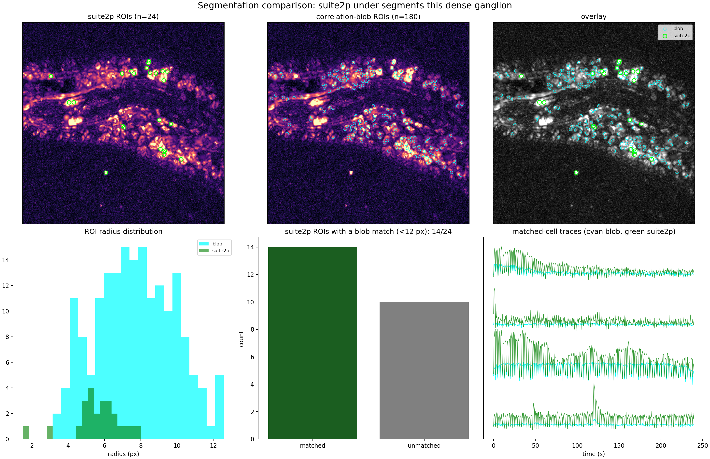

- **What**: a detailed suite2p vs correlation-blob comparison.
- **How**: both ROI sets on the correlation image and overlaid; ROI size histograms; how
  many suite2p ROIs have a nearby blob match; and example traces from cells found by both.
- **How to read**: the overlay and the matched count (14 of 24 suite2p ROIs have a blob
  within 12 px) show the methods agree where they overlap, but the blob method captures
  far more of the visible cells.

### fig_dash_roi_gallery.png
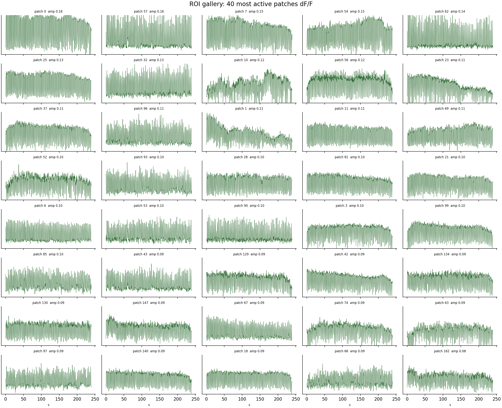

- **What**: a contact sheet of the 40 most active patches.
- **How to read**: each tile is one patch's dF/F (shared scale) with its id and amplitude;
  a quick way to eyeball signal quality and confirm the rhythm is widespread.

### fig_dash_qc_panel.png
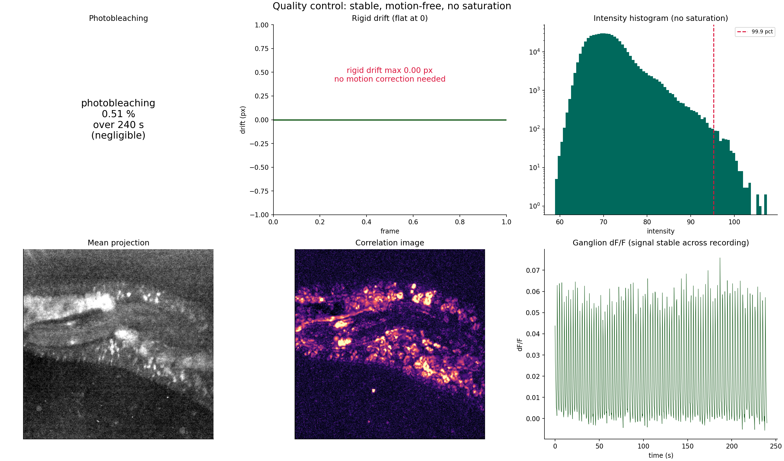

- **What**: a polished recap of the quality control.
- **How to read**: bleaching negligible, drift flat at 0 (no motion correction), intensity
  histogram with no saturation, and the mean/correlation projections. Confirms the data
  are clean to analyze directly.

### fig_dash_trace_quality.png
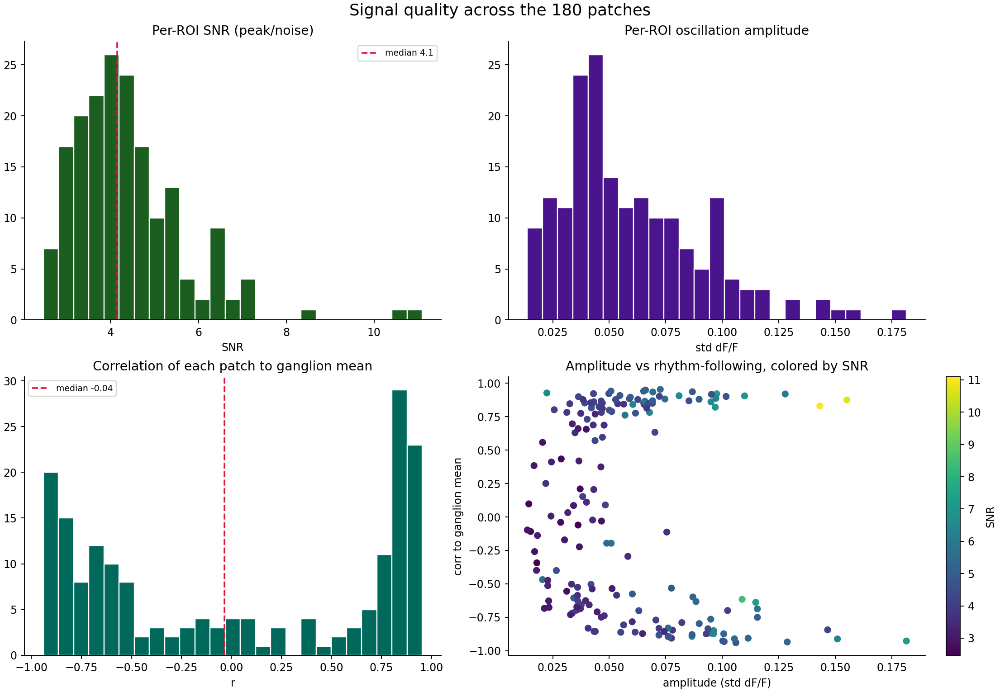

- **What**: how good the per-patch signals are.
- **How**: distributions of per-ROI SNR, oscillation amplitude, and correlation to the
  ganglion mean; plus amplitude vs rhythm-following colored by SNR.
- **How to read**: median SNR ~4.1; about 40% of patches follow the ganglion mean at
  r > 0.5. This is the key nuance: a strong rhythmic subset drives the clean ganglion
  signal, while many weaker patches are noisy (expected at 10x, low photon counts).

---

## Reading order suggestion

- Start with `fig_dash_master.png` for the overview.
- Then `s1_motion.png` and `fig_dash_qc_panel.png` to trust the data (no motion, no bleaching).
- Next `s2b_method_comparison.png` to understand the ROIs.
- Then `s3_spectrum.png` and `fig_spec_wavelet.png` for the rhythm frequency and its stability.
- Then `fig_cycle_kymograph.png` and `fig_cycle_phase_montage.png` for the synchronous,
  standing nature of the oscillation.
- Finally `fig_dash_trace_quality.png` for the caveat that a rhythmic subset carries the signal.

## Caveats that apply to every figure

- 10x, preliminary line: interpret at the ganglion/regional level, not single neurons.
- "After dopamine pharyngals" but **no pre-dopamine baseline** exists here, so no causal
  claim about dopamine driving the rhythm.
- Sampling at 2.882 Hz resolves the 0.37 Hz rhythm well (~8 samples/cycle) but anything
  above ~1.4 Hz would be aliased.
